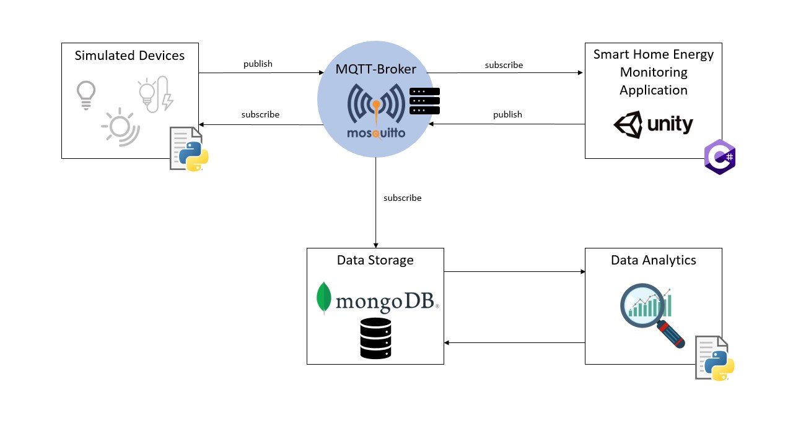

# Advanced Web Technologies Project WS23/24 - TU Berlin
### awt-pj-ws2324-metaverse-digital-twins-1



This project utilizes Unity3D to create a Digital Twin simulation of a smart home, incorporating MQTT protocol to simulate interactions between IoT devices, aiming to optimize energy efficiency and streamline smart home management.

# Project Structure

**Directory:**

```application/Assets```

Subdirectorys

```M2MqttUnity```

- `BrokerSettings.cs`: ...
- `M2MqttUnityClients.cs`: ...

```Lamp Assets```
- `filename`: ...
- `filename`: ...

**Directory:**

```messaging```
- `mosquitto.conf`: Contains the default MQTT broker port configuration 

**Directory:**

```simulation```
- `LightSimulation.py`: Contains IoT device simulation for the light sensor and the light bulbs 

**Directory:**

```storage/scripts```
- `MongoDBbridge.py`: Builds the connection between the MQTT broker and MongoDB in order to store  energy data

**Directory:**

```storage/database exports```
Holds in all exported database collection from MongoDB. It contains...
- The generated IoT simulation data from the LighSimulation.py script
- The calculated energy consumption from the Digital Twin unity application 
- The simulation experiment results for 24 and 96 hours

**Directory:**

```performance/scripts```
- `MeasureGpuPerformance.ps1`: Powershell script to measure GPU performace during simulation for windows
- `MeasureMemoryCpuPerformance.py`: script to measure gpu performace during simulation for Mac/Linux
- `VisualizeGpuUsage.py`: Creates a diagram to visualize measured gpu usage
- `VisualizeMemoryCpuUsage.py`: Creates a diagram to visualize measured memory and cpu usage

### Dependencies

Ensure you have the following requirements:

   - Shell environment with `git` and `pyhton3-pip` 

### Prerequesite


If you are working with windows it is assumed to have at least `windows 10 or higher` and to use `windows subsytem for linux (WSL)` 

## User Guide

To setup and run the digital twin simulation follow the instructions:


**1. Clone the repository**

```
git clone https://github.com/JennyFomin/awt-pj-ws2324-metaverse-digital-twins-1.git
```

**2. Make the bash scripts executable**
```
chmod +x setup.sh start.sh stop.sh
```
**3. Run the setup.sh script to install required technologies and librarys**

```
./setup.sh
```

This script will install the follwing requirements:
- Mosquitto MQTT
- MongoDB
- MongoDB Compass

and librarys (also listed in requirements.txt):
- matplotlib
- paho_mqtt
- pandas
- psutil
- pymongo

**3. Run the start.sh script to start the backend application**

```
./start.sh
```
This will
- start the mqtt broker with the given configuration
- start the mongodb server
- built a communication bridge between mongodb and the mqtt broker
- start the iot device simulation

**4. Start the unity3d digital twin application by executing the following file**

Windows
```
EnergyMonitoringDigitalTwin.exe
```


## Manual User Guide
If you don't want to start the application using the bash script you can start it by following the next setps.

**1. Start mosquitto mqtt with the given configuration**

Linux
```
mosquitto -c mosquitto.conf
```
Windows
```
code...
```

**OPTIONAL: Test mqtt connection**
1. Open a new terminal and start a subscriber by subscribing to all topics

Linux
```
mosquitto_sub -h localhost -t "#" -v
```
Windows
```
code...
```
1. Open another terminal and publish a test message to the broker. This message should be seen in the subscriber terminal from above.

Linux
```
mosquitto_pub -h localhost -t "test_topic" -m 'Hello, Mosquitto!'
```
Windows
```
code...
```

**2. Start mongodb server**

Linux
```
sudo systemctl start mongod
```
Windows
```
code...
```
**3. Built the communication between mongodb and the mqtt broker in order to store the data**

Linux
```
python3 MongoDBbridge.py
```
Windows
```
code...
```

**OPTIONAL: If you want to monitor the data received by the mongodb you can connect mongodb compass to the database with the following adress:**

```
URI: mongodb://localhost:27017
```
**4. Start the iot device simulation**

Linux
```
python3 LightSimulation.py
```
Windows
```
code...
```

**4. Start the unity3d digital twin application by executing the following file**

Windows
```
EnergyMonitoringDigitalTwin.exe
```
